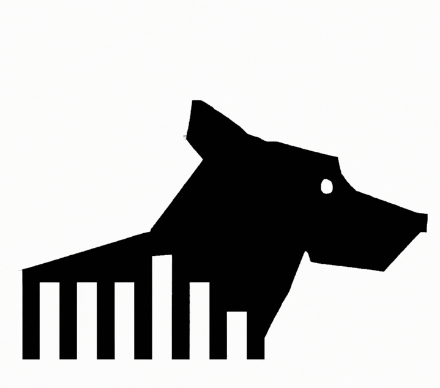

# ddog • [](https://github.com/abigger87/ddog/actions/workflows/ci.yml) 

A **Minimal** Datadog SDK Built in _Pure_ Rust.

## Getting Started

Add the `ddog` crate to your project:

```rust
ddog = "0.1.0"
```


## License

[AGPL-3.0-only](https://github.com/abigger87/ddog/blob/master/LICENSE)


## Acknowledgements

- [datadog-apm-rust-sync](https://github.com/kitsuneninetails/datadog-apm-rust-sync)

